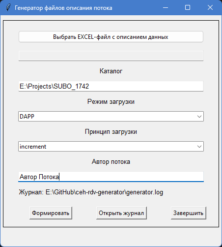

# Генератор артефактов потоков RDV на основе маппинга

"Лежит" здесь: https://github.com/RedPank/ceh-rdv-generator/tree/feature-2
Пароль, что-бы залить в "корень" проекта отсутствует.

## Описание
Генератор, на основе данных в формате EXCEL, формирует файлы описания потоков RDV: 
 * Скрипт, в формате SQL, для создания целевой таблицы;
 * Описание ресурса целевой таблицы в формате json;
 * Описание ресурса хаб - таблицы в формате json (если необходимо);
 * Описание ресурса БК - схемы хаб - таблицы в формате json (если необходимо);
 * Описание ресурса для таблицы - источника в формате json;
 * Файл рабочего потока в формате скрипта python;
 * Файл управляющего потока в формате yaml;
 * Файл описания целевой таблицы в формате yaml;
 * Файл описания хаб-таблицы в формате yaml (если необходимо);
 * Файл описания таблицы-источника;
 * Файл описания рабочего потока в формате yaml.

На основе сформированных файлов в AirFlow создаются управляющий и рабочий потоки для загрузки данных из 
таблицы - источника в целевую таблицу и, если необходимо, в хаб-таблицу(ы).   

## Установка
Для работы требуется **Python 3.12** версии и выше

1. Клонировать репозиторий на локальный ресурс (диск)
2. Открыть терминал и создать в папке виртуальное окружение
```bash
py -m venv venv 
# или 
python -m venv venv
```
3. Перейти в режим виртуального окружения при помощи запуска скрипта (важно, чтобы запуск скрипта был именно через **cmd**, на не через PowerShell). Если в начале командной строки появилась надпись **(venv)**, то переход в виртуальное оркужение произошёл успешно.
```bash
.\venv\Scripts\activate.bat
```
4. Установить необходимые зависимости для виртуального окружения с помощью команды
```bash
py -m pip install -r requirements.txt 
# или
python -m pip install -r requirements.txt
```
5. Для проверки запуска программы необходимо выполнить команду:
```bash
py main.py 
```

Если все пункты выполнены успешно - **Вы великолепны!**
## Окно программы
При запуске программы отображается диалог:



Диалог содержит следующие элементы:
 * `Выбрать EXCEL-файл с описанием данных` - открывает диалог выбора файла для получения пути к 
EXCEL - файлу с описанием алгоритма загрузки данных из источника в целевую таблицу;
 * `Каталог` - каталог, в котором будут сформированы файлы описания потока. 
Файлы одного потока размещаются в подкаталоге с названием целевой таблицы. 
Если указан НЕ абсолютный путь, то каталог создается "рядом" с файлом main.py;
 * `Режим загрузки` - не используется в настоящее время;
 * `Принцып загрузки` - не используется в настоящее время;
 * `Автор потока` - Имя сотрудника, сформировавшего файлы описания потока. Отображается в тагах потока.
Имя "по умолчанию" можно задать в файле настроек **generator.yaml**;
 * `Эскпортировать` - выполнить операцию формирования фалов описания потока;
 * `Журнал` - открыть во внешней программе журнал формирования файлов потока.  

## Файл конфигурации
Файл конфигурации `generator.yaml` находится рядом с модулем main.py
Перед началом работы рекомендуется изменить файл "под себя":
 * В секции "Ссылки/Якоря" изменить значения ссылок: 
   * anchor_author - автор проекта
   * anchor_team - команда, работающая над проектом
   * anchor_subo - Слой устойчивых бизнес операций
   * anchor_area - Предметная область
 * Изменить значение переменной "templates", если Ваш набор шаблонов находится в "нестандартном" каталоге.
Если в переменной указан относительный путь (без указания "корня" каталога), то считается, что каталог с шаблонами находится "рядом" с фалом main.py
 * Настроить программу для просмотра журнально файла в переменных log_viewer/log_file_cmd. По умолчанию используется программа Notepad++
 * Указать каталог для формирования фалов описания потоков в переменной out_path

## Изменения

#### Список 1
 * Удалена возможность выбора способа загрузки "snapshot"
 * Удалена возможность выбора источника
 * Весь вывод перенаправлен из консоли в журнальный файл, который можно открыть во внешнем редакторе вручную 
или через "кнопку" графического интерфейса  
 * Добавлена настройка через использование файла конфигурации generator.yaml.
Файл содержит возможность сделать следующие настройки:
   * Имя автора
   * Название команды проекта
   * Название СУБО
   * Название Предметной области
   * Каталог с файлами шаблонов (по умолчанию "templates", находящийся "рядом" с main.py)
   * Программа для просмотра журнального файла
   * Каталог для сохранения сформированных фалов (по умолчанию "999", находящийся "рядом" с main.py)
   * Набор строк для формирования секции tags в файлах wf_\*.yaml, cf_\*.yaml
   * Список названий полей, которые НЕ будут использоваться для формирования hash
   * Список полей, которые НЕ включаются в опцию distributed_by / multi_fields
   * Список полей целевой таблицы, которые НЕ будут добавлены в секцию field_map шаблона wf_\*.yaml
   * Список полей с описанием, которые БУДУТ добавлены в секцию field_map шаблона wf_\*.yaml
   * Список предопределенных "связок" поле - тип поля для целевой таблицы, 
   для выполнения проверки типов "технических" полей
   * Список возможных значений колонки "Tgt_attr_datatype", для выполнения проверки данных в EXCEL
   * Список возможных значений колонки "Src_attr_datatype", для выполнения проверки данных в EXCEL
   * Список имен колонок на листах файла EXCEL, которые должны присутствовать, для выполнения проверки данных в EXCEL   *
   * Колонка Expression может содержать выражение PostgreSQL (начинается со знака "=")
   
#### Список 2
 * Добавлено формирование файлов:
   * Описание хаб-таблиц (yaml)
   * Описание "корневого" ресурса хаб-таблиц (json)
   * Описание ресурса хаб-таблиц (json) для БК-схем
____________________

## Целевые файлы (результат)
Программа помещает результат работы в каталог заданный в диалоге (поле "Каталог"). 
Внутри каталога располагаются подкаталоги потоков, названные по имени целевой таблицы потока.
Структура каталогов с файлами потока аналогична структуре каталогов репозитория
через который происходит публикация наработок (adgp, etl-scale):

```
+---adgp 
¦   L---extensions
¦       L---ripper
¦           L---.data                         # Скрипт создания целевой таблицы 
+---etl-scale
¦   +---general_ledger
¦   ¦   L---src_rdv
¦   ¦       +---dags                          # wf_/*.py 
¦   ¦       +---flow_dumps                    # Файл описания управляющего потока
¦   ¦       L---schema
¦   ¦           +---ceh
¦   ¦           ¦   L---rdv                   # Файл описания целевой иаблицы
¦   ¦           +---db_tables                 # Файл описания таблицы - источника
¦   ¦           L---work_flows                # Файл описания рабочего потока
¦   L---_resources
¦       +---ceh
¦       ¦   L---rdv                           # Ресурс целевой таблицы 
¦       L---uni
¦           L---dapp
¦               L---prod_repl_subo_nobankserv # UNI - ресурс источника
L---src                                       # Скрипт для формирования скрипта создания акцессоров 
```
